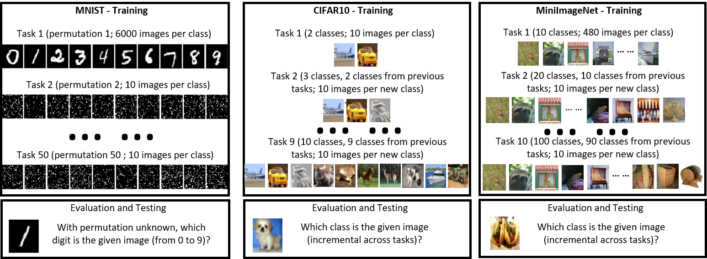

# Variational Prototype Replays for Continual Learning
Authors: Mengmi Zhang, Tao Wang, Joo Hwee Lim, and Gabriel Kreiman, and Jiashi Feng

This repository contains an implementation of a few-shot continual learning method for preventing catastrophic forgetting in object classification tasks. Our paper is currently under review.

Arxiv version is [HERE](https://arxiv.org/abs/1905.09447).

## Project Description

Continual learning refers to the ability to acquire and transfer knowledge without catastrophically forgetting what was previously learned. In this work, we consider few-shot continual learning in classification tasks, and we propose a novel method, Variational Prototype Replays, that efficiently consolidates and recalls previous knowledge to avoid catastrophic forgetting. In each classification task, our method learns a set of variational prototypes with their means and variances, where embedding of the samples from the same class can be represented in a prototypical distribution and class-representative prototypes are separated apart. To alleviate catastrophic forgetting, our method replays one sample per class from previous tasks, and correspondingly matches newly predicted embeddings to their nearest class-representative prototypes stored from previous tasks. Compared with recent continual learning approaches, our method can readily adapt to new tasks with more classes without requiring the addition of new units. Furthermore, our method is more memory efficient since only class-representative prototypes with their means and variances, as well as only one sample per class from previous tasks need to be stored. Without tampering with the performance on initial tasks, our method learns novel concepts given a few training examples of each class in new tasks.

||
|:---:|
| Schematics of three task protocols in our few-shot continual learning experiments: learning with incremental domain on permuted MNIST; and (b) learning with incremental classes on split CIFAR10 and MiniImageNet. The number of images per class per task is illustrated in the schematics. |

## Pre-requisite

The code has been successfully tested in Ubuntu 18.04 with one GPU (NVIDIA RTX 2080 Ti). It requires the following:
- PyTorch = 1.1.0 
- python = 2.7
- CUDA = 10.2
- torchvision = 0.3.0

Dependencies:
- numpy
- opencv
- scipy
- matplotlib
- skimage

Refer to [link](https://www.anaconda.com/distribution/) for Anaconda installation. Alternatively, execute the following command:
```
curl -O https://repo.anaconda.com/archive/Anaconda3-2019.03-Linux-x86_64.sh
bash Anaconda3-2019.03-Linux-x86_64.sh
```
After Anaconda installation, create a conda environment:
```
conda create -n pytorch27 python=2.7
```
Activate the conda environment:
```
conda activate pytorch27
```
In the conda environment, refer to [link](https://pytorch.org/get-started/locally/) for Pytorch installation.

Download our repository:
```
git clone https://github.com/kreimanlab/VariationalPrototypeReplaysCL.git
```

## Quick Start

### Permuted MNIST and Split CIFAR10

The following instructions below are meant for permuted MNIST protocol but similar instructions can be applied in Split CIFAR10 protocol except that the folder to excute commands changes to  ```CIFARincrement/variationalProtoCL```.

Navigate to ```MINSTpermuted/variationalProtoCL/``` using the following command:
```
cd MINSTpermuted/variationalProtoCL/
```
Run the script and select GPU ID (example below selects GPU ID 0) to start training, evaluating and testing for total 50 tasks on GPUs. 
```
./fewshots.sh 0
```
The trained models are saved in ```MINSTpermuted/variationalProtoCL/models```. The test results and variational prototypes for each task are stored in ```MINSTpermuted/variationalProtoCL/results```.

Use the following scripts to re-format the test results and save to ```.mat``` for Matlab plots using script ```plots/MNIST_full.m```.
```
python EvalDataPlot.py
```
**NOTE** Modifications of output path directory may be needed for evaluation and plotting.

### Split miniImageNet

Download Mini-ImageNet dataset from [HERE](https://drive.google.com/open?id=1RxTC3iHrfh5rdmAEVkwWMrYUuYuuPepC), unzip and place the downloaded dataset ```mini_imagenet``` in folder ```IMAGENETincrement/variationalProtoCL/```

Run the following command only ONCE to pre-process miniImageNet images:
```
cd IMAGENETincrement/variationalProtoCL/dataloaders/
python preprocess_mini_imagenet.py
```
**NOTE** Modifications of path directory are needed in ```preprocess_mini_imagenet.py```.

Follow instructions for permuted MNIST above for training, evaluating and testing our method in split miniImageNet protocol.

## Notes

The source code is for illustration purpose only. We do not provide techinical supports but we would be happy to discuss about SCIENCE!

## License

See [Kreiman lab](http://klab.tch.harvard.edu/code/license_agreement.pdf) for license agreements before downloading and using our source codes and datasets.
